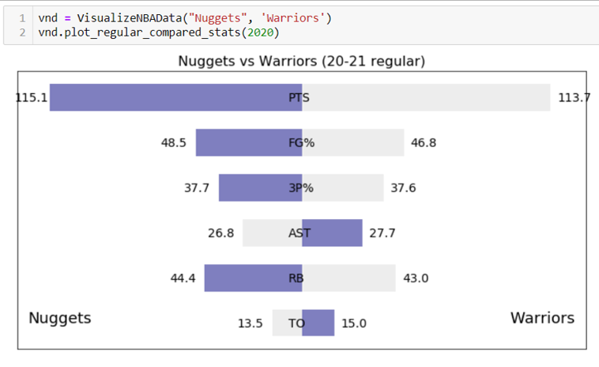

# VisualizeNBAData

這個小專案主要功能為以視覺化方式呈現NBA球隊數據，並從[NBA台灣](https://nba.udn.com/nba/index)爬取資料輔助進行。
+ [使用方法](#使用方法)
+ [初始建置](#初始建置)
+ [查看季賽數據圖](#查看季賽數據圖)
+ [查看季後賽數據圖](#查看季後賽數據圖)
+ [查看季賽球隊比較圖](#查看季賽球隊比較圖)

## 使用方法
目前只可在Anaconda Python 3以上環境運作T^T，日後有餘力將嘗試包裝.exe以方便執行。

## 初始建置
在```VisualizeNBAData.py```中的初始預設為：
```
vnd = VisualizeNBAData("Nuggets")
```
此為所選擇的第一支球隊，可以自由輸入欲查看的球隊(必須符合```NBATeamlist```中的名稱，否則在爬蟲時將無法順利擷取資料)。

接下來所呈現的季賽、季後賽數據圖皆會以第一支球隊的數據作圖。

若希望觀看球隊之間的比較圖，則需要再輸入第二支球隊名稱，例如：
```
vnd = VisualizeNBAData("Nuggets", "Warriors")
```
如此一來便可順利查看球隊比較圖。

## 查看季賽數據圖
呼叫plot_regular_stats方法，以圖表方式呈現所選球隊歷年(2011-12賽季開始)之

季賽場均 (得分、助攻、籃板、命中率、三分球命中率、失誤) 六項數據以及該賽季所遭遇對手之場均數據。
```
vnd.plot_regular_stats()
```


## 查看季後賽數據圖
呼叫plot_playoffs_stats方法，以圖表方式呈現所選球隊(2011-12賽季開始)之

季後賽場均 (得分、助攻、籃板、命中率、三分球命中率、失誤) 六項數據以及該賽季所遭遇對手之場均數據。
```
vnd.plot_playoffs_stats()
```


## 查看季賽球隊比較圖
呼叫plot_regular_compared_stats方法，此方法需要額外輸入年份，

將呈現該賽季所選兩支球隊之

季賽場均 (得分、助攻、籃板、命中率、三分球命中率、失誤) 六項數據比較。
```
vnd.plot_regular_compared_stats(2020)
```

